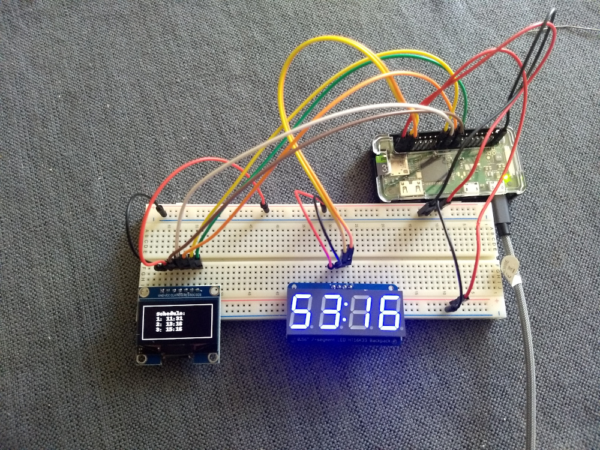

# Python and Raspberry Pi (work in progress)
## Required hardware
Required: 
<ul>
<li>Raspberry Pi (zero W). <a href=https://www.adafruit.com/product/3400>Can be purchased here</a></li>
<li>sh1106 display with SPI (I2C will work with modification). <a href=https://www.amazon.com/gp/product/B01N1LZT8L/>Can be purchased here</a></li>
<li>7 segment clock display.  Adafruit 0.56" 4-Digit 7-Segment Display w/I2C Backpack. <a href=https://www.adafruit.com/product/3400>Can be purchased here</a></li>
<li> Misc. electronics for prototyping: bread board, wiring, multimeter etc.</li>
</ul>

## Connections

### Screen display
Will be different for I2C or parallel
<table>
<tr><th>Label</th><th>Desc</th><th>RasPin</th><th>RasDesc</th></tr>
<tr><td>GND</td><td>Ground</td><td>6</td><td>Ground</td></tr>
<tr><td>VCC</td><td>3.3 V</td><td>1</td><td>3.3 Volts</td></tr>
<tr><td>CLK</td><td>Clock</td><td>23</td><td>SCLK</td></tr>
<tr><td>MOSI</td><td>Data</td><td>19</td><td>SP10 MOSI</td></tr>
<tr><td>RES</td><td>Reset</td><td>22</td><td>GPIO25</td></tr>
<tr><td>DC</td><td></td><td>18</td><td>GPIO24</td></tr>
<tr><td>CS</td><td>CE0</td><td>24</td><td>CE0 (SPI)</td></tr>
</table>

### Clock display
https://learn.adafruit.com/adafruit-led-backpack/0-dot-56-seven-segment-backpack-python-wiring-and-setup
<table>
<tr><th>Label</th><th>Desc</th><th>RasPin</th><th>RasDesc</th></tr>
<tr><td>GND</td><td>Ground</td><td>6</td><td>Ground</td></tr>
<tr><td>VCC</td><td>3.3 V</td><td>1</td><td>3.3 Volts</td></tr>
<tr><td>SDA</td><td>I2C SDA</td><td>3</td><td>GPIO2 (SDA)</td></tr>
<tr><td>SCL</td><td>I2C SCL</td><td>5</td><td>GPIO3 (SCL)</td></tr>
</table>

## How to run
`python display.py`

